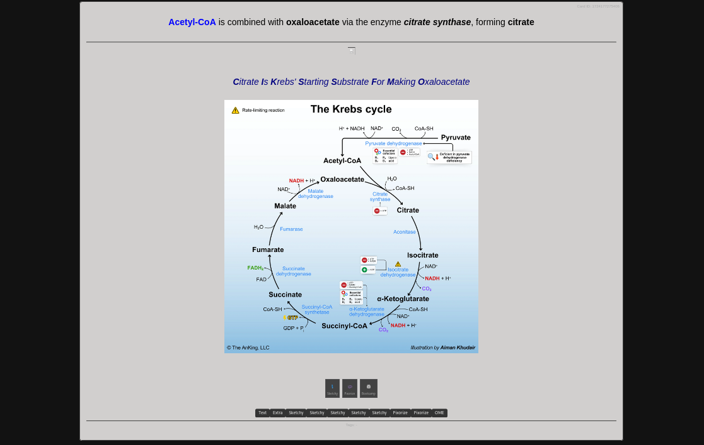
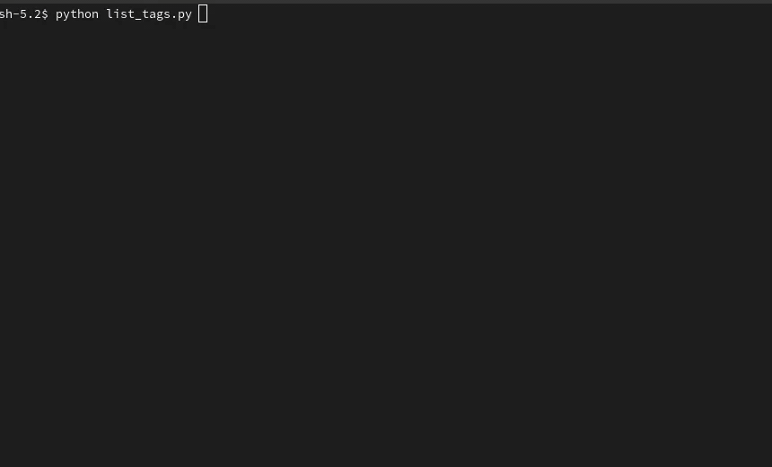

# Anki Connect Python Tools

## Overview

The **Anki Connect Python Toolbox** provides a set of Python scripts for interacting with Anki through the AnkiConnect API. The most important script in this collection is the **HTML Exporter**, which enables users to generate a unified view of their Anki content in a web browser for quick reference and reading. Having all flashcards displayed in a structured, searchable HTML format makes it often easier to review, study, and navigate content quickly.

## Prerequisites

- **Anki** installed on your machine
- **AnkiConnect** add-on installed ([Download AnkiConnect](https://ankiweb.net/shared/info/2055492159))
- **Python 3.x** installed
- Required Python libraries: `requests`, `json`, `tkinter`, `argparse`, `curses`

## Scripts & Functionality

### 1. `anki_export.py`

**Description:**

- Exports Anki cards into an HTML file for **quick reference in a web browser**.
- Provides a structured and searchable layout, ensuring a **unified reading experience**.
- Hidden content and media files can be opened in seperate popup-windows. 
- Makes it easier to review Anki content without needing to open the Anki app.

**Usage:**

```sh
python anki_export.py
```

**Features:**

- Supports exporting flashcards either **by deck** or **by tag hierarchy**, allowing flexible content selection.
- Generates a user-friendly HTML file containing all exported flashcards.
- Supports **search and filtering** for easier content navigation.
- Ideal for reviewing flashcards on different devices via webbrowser. 



---

### 2. `search_to_html.py`

> Export cards (including media and formatting) to an interactive **HTML viewer**, filtered by search terms or deck.

**Usage:**

```bash
python search_to_html.py --terms "Keyword1,Keyword2" [--deck "Deck Name"] [--port 9090] [--cleanup]
```

**Options:**

- `--terms` — Comma-separated terms (matched in text, tags, or deck).
- `--deck` — Optional: Only include cards from this top-level deck.
- `--port` — Optional: Port for local server (default: 8080).
- `--cleanup` — Delete export folder after serving.

**Example:**

```bash
python search_to_html.py --terms "Polymyositis,Dermatomyositis" --deck "Ankizin - HighYield Innere" --port 9090 --cleanup
```

### 3. `tag_to_deck.py`

> Clone notes matching **all specified tags** into a **new or existing deck**.

**Usage:**

```bash
python tag_to_deck.py 'tag1' 'tag2' --deck "Target Deck" [--shuffle]
```

**Options:**

- `tag1 tag2 ...` — Tags the notes must include (AND logic).
- `--deck` — Target deck name.
- `--shuffle` — Shuffle the order of notes before cloning.

**Example:**

```bash
python tag_to_deck.py Immuno Chemistry --deck "HighYield - Immunochem" --shuffle
```

---


### 4. `list_decks.py`

**Description:**

- Lists all available decks in Anki.

**Usage:**

```sh
python list_decks.py
```

**Features:**

- Fetches all decks and subdecks from Anki.
- Displays the list in the terminal.

---


### 5. `list_tags.py`

**Description:**

- Lists all available tags in Anki.
- Provides an interactive **tag explorer** using a terminal-based UI.

**Usage:**

```sh
python list_tags.py
```

**Features:**

- Organizes tags hierarchically.
- Allows users to navigate through tag levels interactively.
- Uses the `curses` library for smooth terminal navigation. 



---

## Contribution

This project is open to contributions! If you'd like to enhance the scripts, submit a pull request or open an issue on GitHub.

---

## License

This project is licensed under the **MIT License**. Feel free to modify and distribute it as needed.

---

## Support

For any issues, please also check the **AnkiConnect API Documentation**: [AnkiConnect API](https://foosoft.net/projects/anki-connect/). 

deep_intervention@posteo.de


